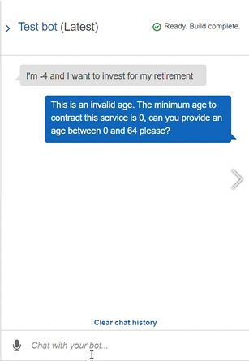
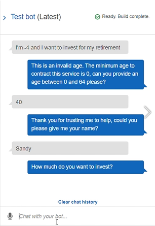
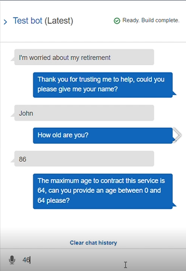
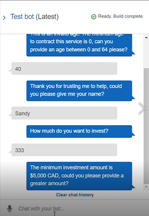
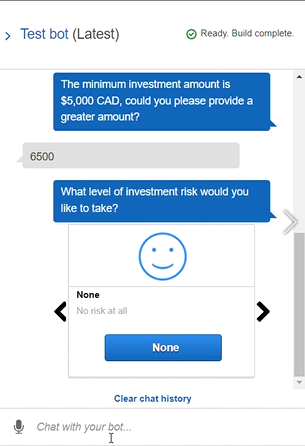
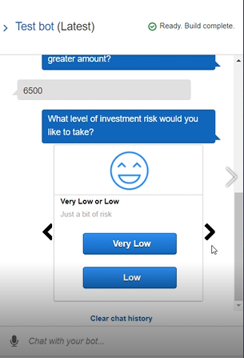
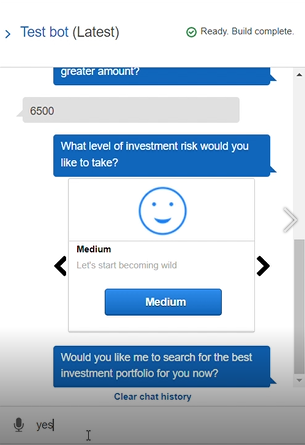
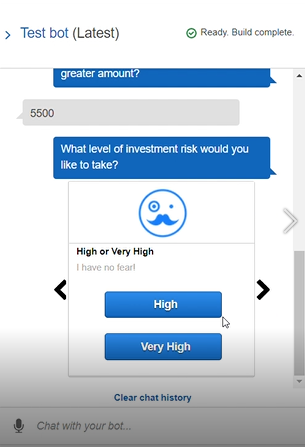
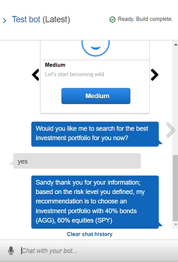
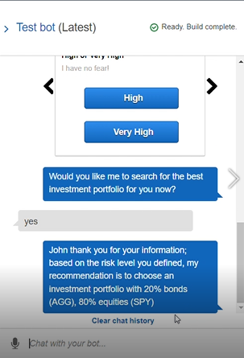

# Robo Advisor for Retirement Plans

This project involved the creation of a robo advisor (bot) that recommends to customers or potential new customers, an investment portfolio for a retirement plan. Amazon Web Services (AWS), and Python were used to create the bot. The robo advisor was configured using an Amazon Lex bot that generated a conversation to obtain the required information and thus suggest the retirement investment portfolio. The bot was then built and tested in Lex. Lastly, an Amazon Lambda function was created to validate the input data and return the investment portfolio recommendation. The Amazon Lambda function was tested and integrated with the bot. In addition, Amazon S3 was used to create a bucket to hold the icons that were displayed in the bot's investment risk level response cards.

## Utterances

Many utterances were added to the bot, which the user could type to begin a conversation with the robo advisor. These included:

* I want to save money for my retirement
* I'm ​`{age}​` and I would like to invest for my retirement
* I'm `​{age}​` and I want to invest for my retirement
* I want the best option to invest for my retirement
* I'm worried about my retirement
* I want to invest for my retirement
* I want to invest for retirement
* I would like to invest for my retirement

 Following is a screenshot of one of them being entered into the bot's chat.

 

## Age Validation

The robo advisor requirements included age restrictions. These were, that the age input by the user had to be non-negative and less than 65. In other words, a valid age range was between 0-64 years old inclusive. Following are screenshots of the messages that were returned when invalid ages were entered.

**Age less than zero:**

**Age greater than 65:**

## Minimum Investment Amount Validation

The robo advisor requirements also included a minimum investment amount of $5,000 CAD. Following is a screenshot of the message that was returned when an smaller amount was input.

## Risk Level Selection

Once a sufficient investment amount was entered, the user was asked to select the level of investment risk that they wanted to take. These included: None, Very Low or Low, Medium, and High or Very High. Following are the screenshots of how these options were presented to the user.

**None:**

**Low or Very Low:**

**Medium:**

**High or Very High:**

## Investment Portfolio Recommendation

Lastly, the user was presented with an investment portfolio recommendation based on the investment risk level that they had selected. These are the recommendations for each risk level:

* **None:** "100% bonds (AGG), 0% equities (SPY)"
* **Very Low:** "80% bonds (AGG), 20% equities (SPY)"
* **Low:** "60% bonds (AGG), 40% equities (SPY)"
* **Medium:** "40% bonds (AGG), 60% equities (SPY)"
* **High:** "20% bonds (AGG), 80% equities (SPY)"
* **Very High:** "0% bonds (AGG), 100% equities (SPY)"

Following are the screenshots of investment portfolio recommendations for two risk levels.

**Medium Risk Recommendation:**

**High Risk Recommendation:**

## Robo Advisor Demo:

https://github.com/brilliantlyc/unit13-challenge/blob/main/RoboAdvisor/RoboAdvisorDemo.mp4

